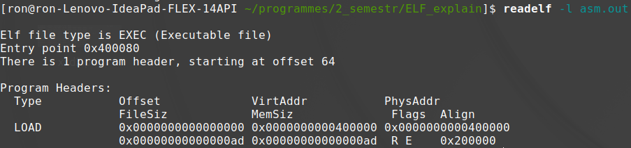

# Create-elf-in-10-minutes
After this tutorial you can create elf files. Tutorial takes 10 minutes

# Install
To deal with binary files you have to
* ```sudo apt-get install xxd```
* ```sudo apt-get install readelf```

# Try asm
Let's try to make elf file from the asm

Here simple nasm code
```asm
section .text
    global _start
    _start:
        nop
        nop
        nop
        mov rax, 1  ;
        mov rdi, 1  ; Print 10 characters
        mov rsi, $  ; From the code ($ - means current position)
        mov rdx, 10 ;
        syscall
        mov rax, 60 ; end program
        mov rdi, 0  ;
        syscall
        nop
        nop
        nop
```


Do ```nasm -w+all -f elf64 -o 'simple_asm.o' 'simple.asm'; ld -o 'asm.out' 'simple_asm.o'; ./asm.out```. And you get ELF ams.out file. Let's see it with ```xxd asm.out```.
>Your system may have another command options


# Oh my god
It is very big and has a lot of useless stuf. We can rid of it with sstrip. To do it, in the asm.out repository do:
1. ```git clone https://github.com/BR903/ELFkickers.git```
2. ```cd ELFkickers/sstrip```
3. ```make```
4. ```./sstrip ../.../asm.out```
5. ```cd ../../```

Let's see the elf file now:  ```xxd asm.out```


Pretty small now! Look carefully at the code. It must contain 909090 In the end (Red rectangle). It is our nop instructions!!!


Code exist between this nop's isntructions. The green area it is the ELF header. 

So, to build programs if ELF format all we need - it is understand this format. It is not very hard.

To analyse headers run: ```readelf -h asm.out```
We get text like this:


For our simple purposes we should not touch this file.

Actually, out ELF file contain TWO headers. ELF header and program header. ELF header describe elf file, program header describe program.

Let's analyse program header:
```readelf -l asm.out```
We get text like this:

)

The structure of program header is:

)

For our purposes we have to change only two parameters:
* p_filesz 
* p_memsz
They should be equal: Headers size + Program size, where Header size = 0x80 

#Conclusion
All you need - is just put two headers (ELF header and program header) before your program, change p_filesz, p_memsz and Linux will run it!

# STRONGLY RECOMMENDED
## For dipper analise
https://cirosantilli.com/elf-hello-world#program-header-table
